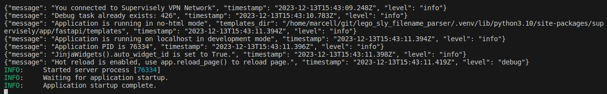
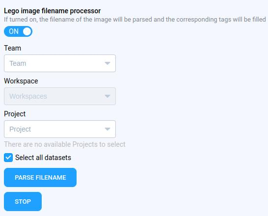
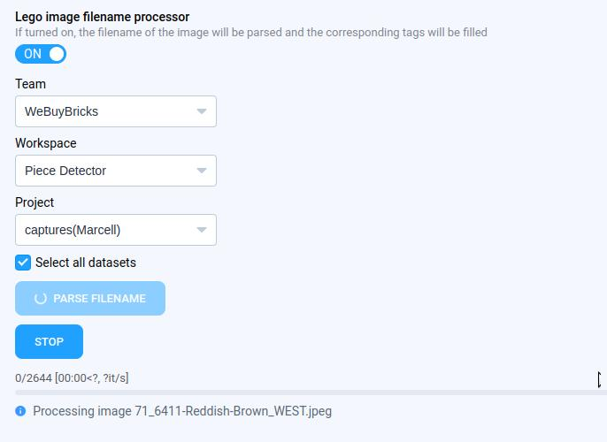
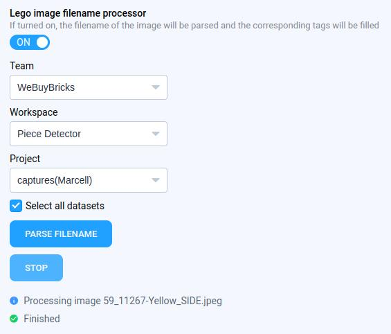
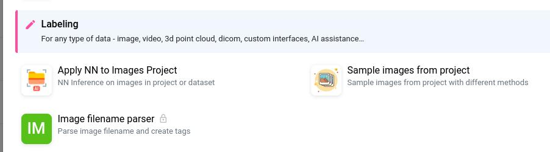
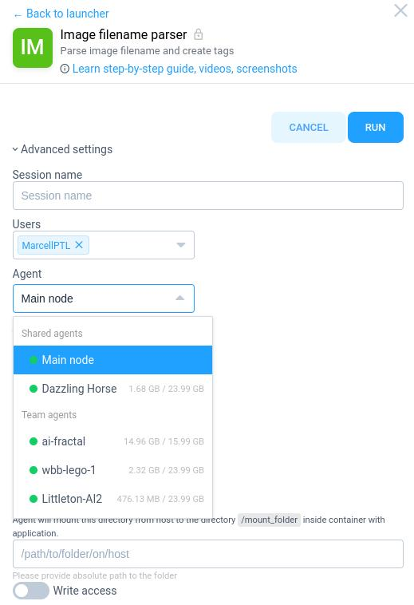

# Lego image filename parser

## Introduction

This code is designed to parse filenames and create tags using the Supervisely SDK. If the necessary tags are not present in a project, it will create those tags. Subsequently, it parses the image filenames within the dataset, populating the newly created tags with their respective values.

## How to debug this tutorial

**Step 1.** Prepare `~/supervisely.env` file with credentials. [Learn more here.](https://developer.supervise.ly/getting-started/basics-of-authentication#how-to-use-in-python)

**Step 2.** Clone repository and create virtual environment, where the project requirements are installed.

**Step 3.** Start debugging `src/main.py` by clicking on the play button.

> **_NOTE:_** if you encounter the following issue:
ModuleNotFoundError: No module named 'pkg_resources'
Run the following code:

```
pip install --upgrade setuptools
```

In the terminal, you'll see the completion message indicating the application startup. Proceed to the next step.



**Step 4.** Open `http://0.0.0.0:8000/` to observe the debug run of the program.

Select the **team, workspace, project and datasets** to apply the application. Press the `Parse filename` button to start the process. The program parses all image filenames in the selected dateset(s) and creates tags on an image in Supervisely (counter, part_id, color, camera_id, category). The category is determined based on the part_id extracted from the filename. This information is usefule for coarse label determination and future ML model training.



The progress is indicated by a progress bar at the bottom, providing an estimate of completion time and the number of processed images.



The process can be halted at any time by pressing the Stop button. The progress bar disappears, and "Finished" text becomes visible.




## Custom app creation

The following section describes really well how to add a custom app to Supervisely.
https://developer.supervisely.com/app-development/basics/add-private-app

## Run directly on Supervisely platform

Navigate to a dataset, click on the three dots, and select "Run Apps". Search for the phrase `Lego image` in the list and select this program to run.



> **_NOTE:_** Choose a machine from the advanced list with a GPU to accelerate execution.




## Appendix
Useful links for development:

https://developer.supervisely.com/getting-started/python-sdk-tutorials/images/image-and-object-tags#advanced-api
https://supervisely.readthedocs.io/en/latest/sdk/supervisely.project.project_meta.ProjectMeta.html#supervisely.project.project_meta.ProjectMeta.tag_metas
https://github.com/mjuhaszptl/image_filename_parser
https://github.com/supervisely-ecosystem/labeling-tool-template
https://github.com/supervisely-ecosystem/labeling-tool-template/blob/master/src/main.py
https://github.com/supervisely-ecosystem/ui-widgets-demos/tree/master/text%20elements/001_text
https://developer.supervisely.com/app-development/create-import-app/create-import-app-without-template
https://developer.supervisely.com/app-development/basics/add-private-app
https://developer.supervisely.com/app-development/create-export-app/create-export-app-from-template
https://github.com/supervisely-ecosystem/ui-widgets-demos/tree/master/selection/005_select_dataset
https://developer.supervisely.com/app-development/apps-with-gui
